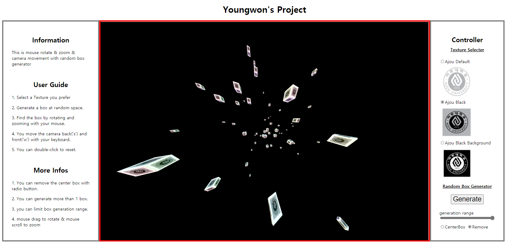
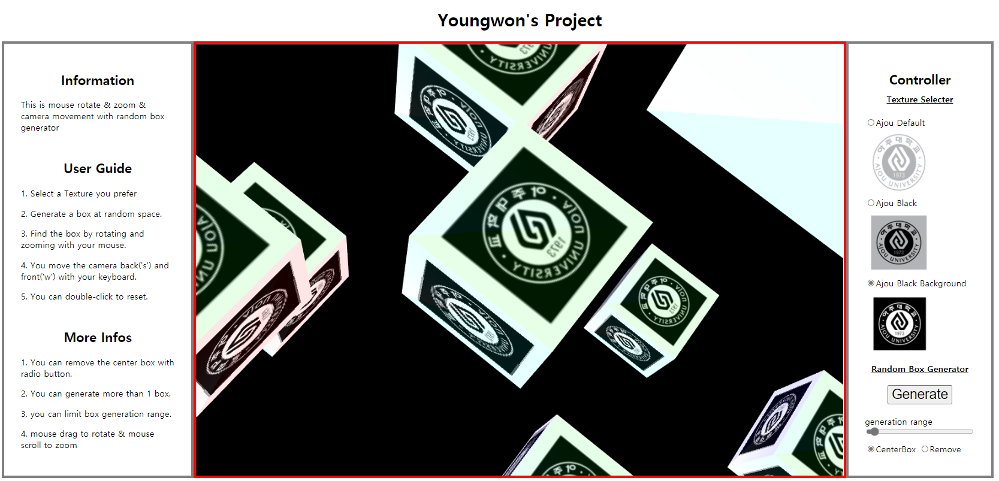

# Youngwon's WebGL Tutorial Project

Make Boxes at random place and Find with mouse drag, wheel and keyboard!



## Introduction
> This is summary of the contents in this document.

### Objective
This project is to learn how to **make boxes at random locations** &  **use mouse drag & wheel & keyboard to control view**,
and also, **texture mapping with several base64 images**. 

### Functions
- Rotation with mouse drag
- Zooming with mouse wheel
- Move camera position back & front
- Texture mapping & switching with base64 images
- Adjust box generation condition
- Generating random boxes
- Reset for some accidental situation

### Chapters
1. Brief Theory Explain
2. Main algorithms with code
3. And so on
4. References


## Brief Theory Explaination
> Here are some basic theories that you should know to understand this project. 

### Mouse Coordinate
There are several mouse coordinates, that we can use for mouse events. For example, pageX & Y is mouse coordinate for entire page, screenX & Y is mouse coordinate for entire screen.
This time, we need a mouse coordinate only for canvas. The offsetX & Y is mouse coordinate for a specific container so I use this mouse coordinate for this project.

### Axis Rotation
To make a rotation, the easiest way is to set a direction of an axis to rotate around and an angle that represents magnitude of the rotation.
The direction of the rotation follows right-hand rule. 

### Cross Product
Result of cross product of two vectors is a vector and the result vector is commonly perpendicular to both two original vectors.
This means 'this vector is the normal vector to the plain that contains both two original vectors.'  
In this project, we use this to get direction of an axis to rotate around.

### Dot Product
Result of dot product of two vectors is a scalar value, and the value is the same as multiplication of cosine and sizes of two vectors.
So, when we use normalized vectors(size with 1), the result is the same as cos of two vectors.  
In this project, we use this value to get angle between two vectors.

### Fov of Perspective view
The angle of perspective view is called fov(Feild of view). When size of viewport is fixed, the object from a distance looks closer as fov decreases.  

### Base64 Images 
Base64 image is a image incoded with 64-characters. This is easy to be converted from other image formats, and this type of images has very good compatibility.

## Main Algorithms with Code
> Here are some codes and algorithm descriptions.


### Mouse Drag to Rotation
- index.html
```
<canvas id="helloapicanvas" style="border: 5px solid red; margin-left: auto " width="1200" height="800" 
                onmousemove="rotate(event);" onmousedown="startRotate(event);" ondblclick="reset();" onwheel="zoom(event);" oncontextmenu="return false"></canvas>
```
 Set mouse move & mouse down events to canvas so that the events can call functions in script.js.  Disabled context menu event to prevent context menu popup.

- script.js - mouse move event
```
function rotate(event)
{
    if (event.which != 0) {
        var curX = (event.offsetX * 2 / canvaswidth) - 1;
        var curY = - (event.offsetY * 2 / canvasheight) + 1;
        var curZ = Math.sqrt(1 - (Math.pow(curX, 2) + Math.pow(curY, 2)));

        if(isNaN(curZ))
            return false;

        var curMouse = vec3.create(); 
        vec3.normalize(curMouse, [curX, curY, curZ]);

        var axis = vec3.create();
        vec3.cross(axis, preMouse, curMouse);
        
        var newRot = mat4.create();
        mat4.rotate(newRot, newRot, rotatefactor * Math.acos(vec3.dot(preMouse, curMouse)) , axis);
        mat4.multiply(mouseRotate, newRot, mouseRotate);

        preMouse = curMouse;

        event.preventDefault();
    }

    return false;
}
```
 **First**, transform mouse coordinates to **normalized coordinate** (from -1 to 1).
 Then, we can calculate Z value that makes the vector becomes size 1. But if size of X and Y becomes bigger than 1 (it can be at the corner of the canvas), we should dismiss the value.  
 **Second**, we use **cross-product** of pre mouse position vector and current position vector to get **direction of Axis**, and **dot-product** to get **angle** of the vectors. Now, we have direction of axis and magnitude of angle, so we can **make a rotation**. I used rotate factor to make rotation a bit bigger.   
 To make next rotation, I set pre mouse position vector as current mouse position vector.
> Rotate function multiplies previous matrix * rotation matrix, but we need rotation matrix * previous matrix, because the vertex vector is multiplied to the right. So I used multiply function.
- script.js - mouse down event
```
function startRotate(event)
{
    curX = (event.offsetX * 2 / canvaswidth) - 1;
    curY = - (event.offsetY * 2 / canvasheight) + 1;
    curZ = Math.sqrt(1 - (Math.pow(curX, 2) + Math.pow(curY, 2)));

    if(isNaN(curZ))
        return false;

    vec3.normalize(preMouse, [curX, curY, curZ]);
    event.preventDefault();
    
    return false;
}
```
 To make rotation, we need pre mouse position vector. The initial value is set when mouse down event calls startRotate function. The algorithm is exactly same as getting current mouse position vector.

 ### Zooming with Mouse Wheel
 - script.js
 ```
 function zoom(event)
{
    if(!(event.ctrlKey || event.shiftKey))
    {
        fov_degree += event.deltaY * 0.1;
        if(fov_degree > 150) fov_degree = 150;
        else if(fov_degree < 30) fov_degree = 30;

        event.preventDefault();
    }
    return false;
}
```
As I mentioned at the theory, if I fix the size of viewport and controll fov of perspective view, we can make a object at a distance **look closer or further**.  
Wheel up -> positive deltaY -> fov increases. Wheel down is opposite.  
fov decreases -> object look closer, fov increases -> object look further.

### Camera Front & Back Movement with KeyDown
- index.html
```
<body style ="width: 1920px"onload="main()" onkeydown="cameramove(event);">
```
Canvas does not support onkeydown event, so I set key down event to the parents contatiner, body.

- script.js
```
function cameramove(event)
{
    if(event.key == 'w' || event.key == 'W' )
        cameraZ--;
    else if (event.key == 's' || event.key == 'S')
        cameraZ++;
    
    if(cameraZ < 1)
        cameraZ = 1;
    if(cameraZ > 15)
        cameraZ = 15;

    event.preventDefault();
    return false;
}
{
    mat4.perspective(pMat, fov_degree * 3.141592 / 180.0 , canvaswidth/canvasheight , 0.2, 50 + cameraZ); 
	mat4.lookAt(vMat, [0,0,cameraZ], [0.0,0.0,0.0], [0,1,0]);
}
```
If keydown events occurs, cameramove function detects the key. If pressed key is 'w' or 'W', camera moves front, and for 's' or 'S', camera moves back.  
The camera can not go to the front of (0,0,1) and camera can not go further than (0,0,15).  
The Z length of the perspective view should be longer as camera goes back.

### Texture Mapping, base64 Images and Switching Textures.
- outside of the code  
I got images.png from Ajou Univ. site and I reduced their sizes to 128 * 128 (to make pow of 2) and converted it to base64.

- index.html
```
<div><input type="radio" name="texture_radio" onclick="imageChange(0);" checked = "true">Ajou Default</input></div>
<div><input type="radio" name="texture_radio" onclick="imageChange(1);">Ajou Black</input></div>
<div><input type="radio" name="texture_radio" onclick="imageChange(2);">Ajou Black Background</input></div>
```
  Use radio buttions to change images, the radio buttons call functions in script.js

- script.js
 ```
{
    var texture = gl.createTexture(); 
    gl.bindTexture(gl.TEXTURE_2D, texture);
    // Fill the texture with a 1x1 red pixel.
    gl.texParameteri(gl.TEXTURE_2D, gl.TEXTURE_MIN_FILTER, gl.NEAREST_MIPMAP_NEAREST);
    gl.texParameteri(gl.TEXTURE_2D, gl.TEXTURE_MAG_FILTER, gl.LINEAR);
    gl.texParameteri(gl.TEXTURE_2D, gl.TEXTURE_WRAP_S, gl.CLAMP_TO_EDGE);
    gl.texParameteri(gl.TEXTURE_2D, gl.TEXTURE_WRAP_T, gl.CLAMP_TO_EDGE);
    // Asynchronously load an image
    
    image.src = "data:image/png;base64, " + ajouUnivDef;
    
    image.addEventListener('load', function() {
        // Now that the image has loaded make copy it to the texture.
        gl.bindTexture(gl.TEXTURE_2D, texture);
        gl.texImage2D(gl.TEXTURE_2D, 0, gl.RGBA, gl.RGBA,gl.UNSIGNED_BYTE, image);
        gl.generateMipmap(gl.TEXTURE_2D);
        });
    
    return testGLError("initialiseBuffers and texture initialize");
}
function imageChange(number)
{
    if(number == 0)
        image.src = "data:image/png;base64, " + ajouUnivDef;
    else if(number == 1)
        image.src = "data:image/png;base64, " + ajouUnivBlack;
    else if(number == 2)
        image.src = "data:image/png;base64, " + ajouUnivBlackBg;
}
```
To set a texture, we need to create a texture, **bind the texture to the buffer**, **set image to the texture**, and optionally generate mipmaps for the texture.
And also, we can set some option paramters for texture minimization and maximization. To simplify the process, we set those process to **'image load' event**.  
The function imageChange loads selected image, and the image load event automatically bind the texture and set image to the texture.
> ajouUnivDef, Black, BlackBg are String that contains base64 image information. 

### Random Box Generator
- script.js
```
var boxes = [];
function generateBox()
{
    var aBox = vec3.create();
    vec3.random(aBox, Math.random() * boxgenRange);
    boxes.push(aBox);
}
{
    boxes.forEach(element => {
        mat4.identity(mMat); 
        mat4.translate(mMat, mMat, element);
        mat4.multiply(mMat, mouseRotate, mMat);
        gl.uniformMatrix4fv(mMatLocation, gl.FALSE, mMat );
        gl.drawArrays(gl.TRIANGLES, 0, 36);
    });
}
```
First, make box position vector at random location. The position vector is randomly seleted from the vectors of size from 0 to boxgenRange.  
Second, translate a box to the position vector, apply mouse rotation and draw it! Then, repeat for every boxes.

## And so on
> This chapter introduces some functions that are not main but needed for convenience.

### Box Gereration Range
Box is generated at random location, and I thought some controls are needed for the generation, so I enabled to set box generation range.
But the range should be limited so that the boxes can not go outside of the perspective view frustum.

### Center Box Remove
To Find a box at random location, the center box can blind the user. So added the option to remove the center box.

### Reset
When user wants to go back to the initial state, user can reset the canvas by double-clicking it. Every boxes except the center box will be removed, the rotation and zoom will be back to the initial state.

# References
### Code reference
- Base Code : Final Exam part C code.zip
- https://git.ajou.ac.kr/hwan/cg_course/-/blob/master/WebGL/texture - texture mapping

### Theory or Function description reference
- https://glmatrix.net/docs/ - gl-Matrix guide
- https://ko.javascript.info/mouse-events-basics - how to use mouse event
- https://developer.mozilla.org/en-US/docs/Web/API/Element/wheel_event - mouse wheel
- https://hianna.tistory.com/493 - mouse coordinates
- https://www.daleseo.com/js-key-events/ - how to use keydown event
- https://velog.io/@byeol4001/Base-64%EC%99%80-base64-img-%EC%82%AC%EC%9A%A9%ED%95%98%EA%B8%B0 - how to use base64 image
- https://codepen.io/ramtob/pen/qZWzeE - radio buttons
- https://hianna.tistory.com/454 - random number
- https://webdir.tistory.com/31 - html align
- https://studiomeal.com/archives/533 - html grid
- https://m.blog.naver.com/PostView.naver?isHttpsRedirect=true&blogId=chandong83&logNo=220812226888 - README.md image

### Source(Image) reference
- https://www.ajou.ac.kr/kr/intro/uidownload.do  - ajou univ logo -> png to base64 (https://onlinepngtools.com/convert-png-to-base64)